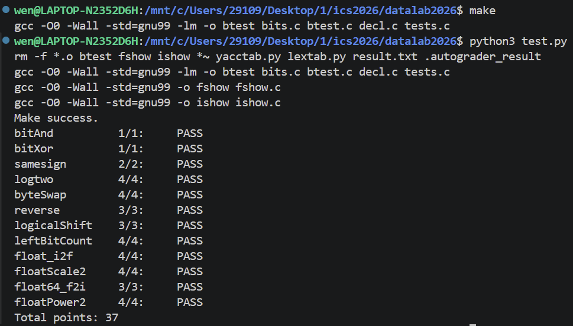
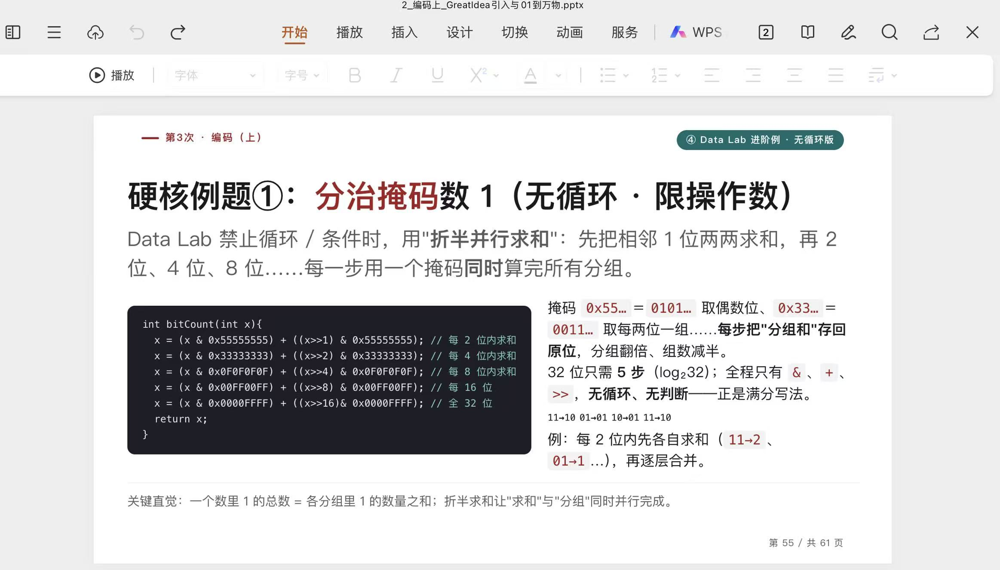

# datalab 报告

姓名：王文龙

学号：2025201444

| 总分 | bitAnd | bitXor | samesign | logtwo | byteSwap | reverse | logicalShift | leftBitCount | float_i2f | floatScale2 | float64_f2i | floatPower2 |
| --- | --- | --- | --- | --- | --- | --- | --- | --- | --- | --- | --- | --- |
| 37 | 1 | 1 | 2 | 4 | 4 | 3 | 3 | 4 | 4 | 4 | 3 | 4 |
| 37 | 1 | 1 | 2 | 4 | 4 | 3 | 3 | 4 | 4 | 4 | 3 | 4 |


test 截图：



## 解题报告

### 亮点


1. logtwo
2. leftBitCount

### bitXor

```text
function bitAnd(x, y)
    result = not(not(x) or not(y))
    return result
end
```
利用德摩根律，可以直接利用 `|` 和 `~` 推出 `&`。

### bitXor

```text
function bitXor(x, y)
    same_one = x and y
    same_zero = not(x) and not(y)
    return not(same_one) and not(same_zero)
end
```

排除两位相同的情况，剩下的就是异或结果。

### samesign

```text
function samesign(x, y)
    特殊处理 0
    sign_x = x 右移 31
    sign_y = y 右移 31
    return not(sign_x xor sign_y)
end
```

比较两个数的符号位即可。

### logtwo

```text
function logtwo(v)
    count = 0
    用shift记录，依次检查16、8、4、2、1位
    每次命中后右移并累计 shift
    return count
end
```

把求 `log2` 转化为寻找最高位 `1`，按 `16 → 8 → 4 → 2 → 1` 二分查找避免使用循环同时精简操作。

### byteSwap

```text
function byteSwap(x, n, m)
    n_shift = n * 8
    m_shift = m * 8
    n_byte = extract byte n
    m_byte = extract byte m
    异或交换
    return result
end
```

先提取，再利用异或交换。

### reverse

```text
function reverse(v)
    result = 0
    重复以下操作32次
        提取右边第一位
        利用右移拼接在result最左边
    end
    return result
end
```

考虑到这题可以用while，再加上一次性翻转难以实现，于是考虑一个一个移动。

### logicalShift

```text
function logicalShift(x, n)
    shifted = x shift right n
    mask = 生成高 n 位为 0 的掩码
    return shifted & mask
end
```

正常右移会产生额外的`1`，则想到用掩码清除。

### leftBitCount

```text
function leftBitCount(x)
    count = 0
    依次检查最左边的16、8、4、2、1位
    每次全为 1 时累计数量并左移跳过
    return count
end
```

对于要查找最左边的情况依旧采取二分策略，按 `16 → 8 → 4 → 2 → 1` 分块统计最高位连续的 `1`。

### float_i2f

```text
function float_i2f(x)
    处理 x = 0
    sign = 取符号位
    对绝对值作操作
    左移寻找最高位 1
    exponent = 根据最高位计算阶码
    fraction = 取 23 位尾数
    tail = 取被舍弃部分
    按规则舍入
    若尾数溢出
        指数加一且尾数化0
    end if
    return 拼接后的结果
end
```

按照符号位、指数和尾数分别处理即可。

### floatScale2

```text
function floatScale2(uf)
    拆出三个部分
    if 指数全一
        return uf
    end if
    if 指数为0
        尾数左移1位
    else
        指数加1
    end if
    处理溢出为无穷
    return 重新拼接结果
end
```

规格化数乘 2 就让阶码加 1；非规格化数则让尾数左移，再分出NaN和无穷的情况。

### float64_f2i

```text
function float64_f2i(low32, high32)
    从 high32 取三个部分，注意指数和尾数部分
    处理 overflow 和 underflow
    real_exponent = exponent - 1023
    恢复隐藏的最高位 1
    if real_exponent <= 20
        从 high32 得到整数部分
    else
        拼接 high32 和 low32
    end if
    if sign == 1
        转为负数补码
    end if
    return value
end
```

分清64位中指数和尾数的构成即可。

### floatPower2

```text
function floatPower2(x)
    if x < -149
        return 0
    end if
    if x < -126
        return 非规格化数
    end if
    if x <= 127
        exponent = x + 127
        return 指数左移23位结果
    end if
    return 正无穷
end
```

根据 `x` 的范围分别构造 0、非规格化数、规格化数和正无穷。 

## 反馈/收获/感悟/总结

位运算感觉有时候就是很需要灵机一动...不然根本就想不出来...

## 参考的重要资料

二分查找思路借鉴了课件PPT中的例题处理方法，课件截图：


